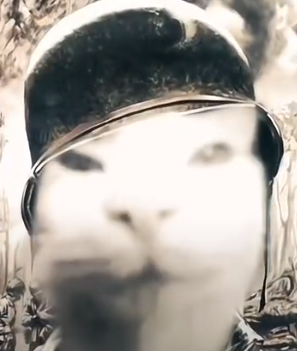

# Projeto MinedleCraft
Um minigame inspirado no Loldle

### Descrição:

    O projeto MinedleCraft consiste na criação de um mini game de adivinhação, inspirado no jogo Wordle. A ideia INICIAL é que os minigames mudem com base no dia, então por exemplo no mobs, um dia vai ser o creeper no outro o esqueleto, ao invés de gerar um desafio novo a cada vez que recarrega a página.

## Índice

- <a href= "#layout">Layout</a>
- <a href= "#rodar">Como rodar este projeto? </a>
- <a href= "#tecnologias">Tecnologias Utilizadas </a>
- <a href= "#autores">Pessoas Autores </a>
- <a href= "#passos">Próximos Passos </a>
## Layout
- Tela Home:
](image-1.png)](image.png)

## Como rodar este projeto?

```bash
# Clone este repositório:
$ git clone https://github.com/matheuscarvalhotheus/Proj-Prog.git

# Acesse a pasta do projeto no seu terminal:
$ cd projx

# Instale as dependências:
$ npm install
```

## Tecnologias Utilizadas

1. [Gimp](https://www.gimp.org/)
2. [Html](https://developer.mozilla.org/pt-BR/docs/Web/HTML)
3. [Css](https://developer.mozilla.org/pt-BR/docs/Web/CSS)
4. [JavaScript](https://developer.mozilla.org/pt-BR/docs/Web/JavaScript)
5. [Json](https://www.json.org/json-pt.html)
6. [NodeJs](https://nodejs.org/pt)

## Autores
- ### [@KORINGAxz](https://github.com/KORINGAxz)
- ### [@matheuscarvalhotheus](https://github.com/matheuscarvalhotheus)
- ### [@Gtagusta](https://github.com/Gtagusta)
- ### [@Endrel10](https://github.com/Endrel10)

